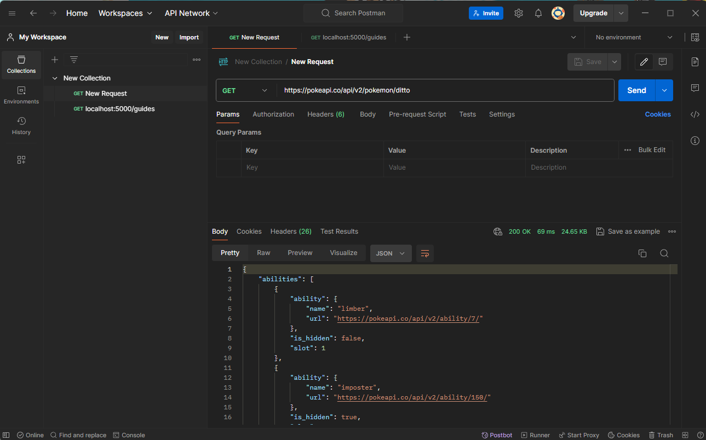

<h1 align="center">Checkpoint 6</h1>
<h2 align="center">Rubens Ballester Lillo</h2>

<h3 align="center">¿Para qué usamos las clases en Python?</h3>  

#### ¿Qué son las clases en Python?

En Python, una clase es una especie de "plano" o "plantilla" que define las propiedades y comportamientos comunes que un tipo de objeto puede tener. Estas propiedades se llaman atributos y los comportamientos se llaman métodos. La clase en sí misma no es un objeto, sino más bien una descripción de cómo crear un objeto.

#### ¿Por qué usar clases en Python?

1. **Organización del código**: Las clases permiten organizar el código de manera estructurada y modular. En lugar de tener todas las variables y funciones dispersas por el código, podemos agruparlas en clases relacionadas, lo que facilita la comprensión y el mantenimiento del código, especialmente en proyectos grandes.
2. **Reutilización de código** : La definición de clases permite encapsular funcionalidades relacionadas en un solo lugar. Esto facilita la reutilización del código, ya que podemos crear múltiples instancias (objetos) de una clase y reutilizar su funcionalidad en diferentes partes de nuestro programa sin tener que volver a escribir el mismo código.
3. **Abstracción**: Las clases nos permiten modelar objetos del mundo real en nuestro código. Podemos representar características y comportamientos comunes de estos objetos a través de atributos y métodos, lo que facilita la comprensión del código para los desarrolladores y permite una mejor comunicación entre el código y el problema real que estamos tratando de resolver.


#### Sintaxis de definición de clases en Python:
 ```py
   class NombreClase:
    # Constructor
    def __init__(self, atributo1):
        self.atributo1 = atributo1

    # Definición de métodos
    def nombre_metodo(self, argumentos):
        # Código del método

 ```

En esta sintaxis:  

1. ```class NombreClase```: define la clase con el nombre NombreClase.
2. ```def __init__ (self, atributo1)```: es el constructor de la clase que se llama automáticamente cuando se crea una nueva instancia de la clase. El parámetro self se refiere a la instancia actual de la clase, y se utiliza para acceder a sus atributos y métodos.
3. ```self.atributo1``` es un ejemplo de cómo definir y asignar valores a los atributos de la clase.
4. ```def nombre_metodo(self, argumentos)```: define un método de la clase. Al igual que el constructor, el parámetro self se refiere a la instancia actual de la clase.

#### Ejemplo detallado de uso de clases en Python:

```py
class Coche:
    # Constructor
    def __init__(self, marca, modelo, color):
        self.marca = marca
        self.modelo = modelo
        self.color = color

    # Método para imprimir información del coche
    def imprimir_info(self):
        print("Marca:", self.marca)
        print("Modelo:", self.modelo)
        print("Color:", self.color)

# Crear una instancia de la clase Coche
mi_coche = Coche("Volkswagen", "Golf", "Gris")

# Acceder a los atributos y métodos del coche
print("Marca del coche:", mi_coche.marca)
mi_coche.imprimir_info()

```

Salida: 
```
Marca del coche: Volkswagen
Marca: Volkswagen
Modelo: Golf
Color: Gris
```
En esta sintaxis:  

1. Se define un método especial llamado ```__init__```, que es el constructor de la clase. Este método se llama automáticamente cuando se crea una nueva instancia de la clase. Toma tres parámetros (marca, modelo, y color) además del parámetro ```self```, que hace referencia a la instancia actual de la clase. Dentro del constructor, se asignan los valores de los parámetros a los atributos de la instancia utilizando self.
2. Se define otro método llamado ```imprimir_info```, que imprime la información del automóvil, es decir, la marca, el modelo y el color.
3. Se crea una instancia de la clase Coche llamada ```mi_coche``` pasando los valores "Volkswagen", "Golf", y "Gris" como argumentos al constructor.
4. Se accede a los atributos del ```objeto mi_coche``` (marca, modelo, y color) usando la notación de punto y se imprime la marca del coche.
5. Se llama al método ```imprimir_info``` del objeto ```mi_coche```, que imprime la información completa del coche (marca, modelo y color) utilizando el método definido en la clase.

En resumen, las clases en Python son fundamentales para organizar y estructurar el código, facilitar la reutilización y abstracción, y modelar objetos del mundo real en nuestros programas.

---

</br>
<h3 align="center">¿Qué método se ejecuta automáticamente cuando se crea una instancia de una clase?</h3>  
</br>
Una instancia de una clase es un objeto específico creado a partir de esa clase. En otras palabras, una instancia es una copia individual de una clase que tiene sus propios valores para los atributos definidos en la clase y puede ejecutar sus propios métodos.  

Para crear una instancia de una clase en Python, simplemente llamamos al nombre de la clase seguido de paréntesis, opcionalmente pasando los argumentos requeridos por el constructor de la clase. Por ejemplo, si tenemos una clase llamada Coche, podemos crear una instancia de ella de la siguiente manera:  

```py
mi_coche = Coche(argumentos)
```

Cuando se crea una instancia de una clase en Python, el método que se ejecuta automáticamente es el método especial ```__init__```, también conocido como el constructor de la clase. Este método se utiliza para inicializar los atributos de la instancia recién creada.  
</br>
**Constructor ```(__init__)```**:
</br>
El constructor es un método especial en Python que se llama automáticamente cuando se crea una nueva instancia (objeto) de una clase. Su nombre es ```__init__``` (doble guion bajo, seguido por "init" y otro doble guion bajo).    
#### Ejemplo:  

```py
def __init__(self, argumentos_constructor):
    # Cuerpo del constructor
```
1. El primer parámetro del método ```__init__``` es ```self```, que hace referencia a la instancia actual de la clase.
2. Los parámetros restantes representan los valores que se pasan al crear la instancia de la clase.
3. Dentro del constructor, se asignan estos valores a los atributos de la instancia utilizando ```self```.

Por ejemplo, en el código del ejemplo anterior:

```py
def __init__(self, marca, modelo, color):
    self.marca = marca
    self.modelo = modelo
    self.color = color
```
1. ```def __init__(self, marca, modelo, color)```: Aquí definimos el método especial ```__init__```, que es el constructor de la clase ```Coche```. Este método se llama automáticamente cada vez que se crea una nueva instancia de la clase. Toma cuatro parámetros: ```self``` (que hace referencia a la instancia actual de la clase) y los atributos específicos de un coche: marca, modelo y color.

2. ```self.marca = marca```: Esta línea asigna el valor del parámetro marca al atributo marca de la instancia actual (referenciada por self). Esto significa que cada instancia de la clase Coche tendrá su propia variable marca con el valor que se le pase al crear la instancia.

3. ```self.modelo = modelo```: Similarmente, esta línea asigna el valor del parámetro modelo al atributo modelo de la instancia actual. Cada instancia tendrá su propio valor para el modelo del coche.

4. **self.color = color```: Aquí, se asigna el valor del parámetro color al atributo color de la instancia actual. De esta manera, cada instancia puede tener su propio color asignado.  

Por lo tanto, cuando creamos una nueva instancia de la clase ```Coche``` como ```mi_coche```, se llama automáticamente al método ```__init__```, pasando los valores especificados como argumentos al crear la instancia. Esto asegura que la instancia se inicialice correctamente con los valores proporcionados.   

---

</br>
<h3 align="center">¿Qué es una API?</h3>  
</br>

#### Definición:

Una API (Interfaz de Programación de Aplicaciones) es un conjunto de reglas y protocolos que permite que diferentes sistemas informáticos se comuniquen entre sí. En otras palabras, proporciona un conjunto de herramientas y definiciones que permiten que una aplicación use ciertas funciones o acceda a ciertos datos de otra aplicación, servicio o sistema operativo de manera segura y controlada.  

#### Ejemplo:

Para entender de manera algo más simple que es una API, esta es como un camarero en un restaurante. El camarero toma tu pedido (solicitud), comunica esa solicitud al cocinero (servidor) y luego trae tu comida (respuesta) de vuelta a ti. En este caso, el camarero actúa como una interfaz entre tú y el chef, simplificando el proceso de pedir comida.  

  

#### Componentes de una API:

1. **Solicitud (Request)**:

- Una solicitud es una acción realizada por un cliente para acceder a ciertos datos o realizar una operación específica a través de la API.
- Puede incluir diferentes elementos, como:
  - Método HTTP: Indica la acción que se desea realizar en el recurso. Los métodos comunes incluyen GET, POST, PUT y DELETE.
  - URL (Uniform Resource Locator): Es la dirección específica del recurso al que se desea acceder.
  - Cuerpo de la solicitud: Contiene los datos que se envían al servidor, como parámetros o información en formato JSON o XML.
    
2. **Respuesta (Response)**:

- Una respuesta es la información devuelta por el servidor de la API en respuesta a una solicitud.
- Puede incluir diferentes elementos, como:
  - Datos solicitados: Si la solicitud es exitosa, la respuesta generalmente incluirá los datos solicitados por el cliente.
  - Mensaje de estado HTTP: Indica si la solicitud se ha procesado correctamente o si se ha producido algún error. Algunos códigos de estado comunes son 200 (OK), 404 (No encontrado) y 500 (Error interno del servidor).
  - Cuerpo de la respuesta: Contiene los datos devueltos por el servidor, generalmente en formato JSON o XML.

3. **Métodos HTTP**:

- Los métodos HTTP son verbos que indican la acción que se desea realizar en un recurso específico.
- Algunos de los métodos HTTP más comunes son:
  - ```GET```: Se utiliza para recuperar datos de un recurso sin realizar cambios en el servidor.
  - ```POST```: Se utiliza para enviar datos al servidor para su procesamiento, como crear un nuevo recurso.
  - ```PUT```: Se utiliza para actualizar los datos de un recurso existente en el servidor.
  - ```DELETE```: Se utiliza para eliminar un recurso del servidor.
 
  En la siguiente pregunta prufundizaremos aún más en este métodos.  
 
4. **Endpoints**:

- Los endpoints son URLs específicas que representan recursos disponibles a través de la API.
- Cada endpoint puede permitir una o más operaciones CRUD (Crear, Leer, Actualizar, Eliminar) en el recurso asociado.
- Por ejemplo, ```/usuarios``` podría ser un endpoint que permite acceder a información de usuarios, mientras que ```/productos``` podría ser un endpoint para acceder a información de productos.

#### Importancia de los Componentes de una API:

- La solicitud y la respuesta son los componentes esenciales que facilitan la comunicación entre el cliente y el servidor a través de la API.
- Los métodos HTTP proporcionan una forma estandarizada de indicar la acción deseada en un recurso específico.
- Los endpoints permiten acceder a recursos específicos a través de la API de una manera estructurada y controlada.

#### Importancia de las APIs:

1. Facilitan la Integración: Las APIs permiten la interoperabilidad entre diferentes sistemas y aplicaciones, lo que facilita la integración de sistemas complejos y la creación de soluciones más completas.
2. Promueven la Reutilización de Código: Al exponer funcionalidades a través de una API, los desarrolladores pueden reutilizar fácilmente el código en diferentes proyectos, lo que ahorra tiempo y recursos y fomenta las buenas prácticas de desarrollo.
3. Fomentan la Innovación: Las APIs abiertas y bien documentadas permiten a los desarrolladores acceder a una variedad de servicios y datos, fomentando la innovación al permitir la creación de nuevas aplicaciones y servicios basados en funcionalidades existentes.

#### Conclusión:

En resumen, una API es una herramienta esencial en el desarrollo de software que facilita la comunicación entre diferentes sistemas, aplicaciones o servicios. Proporciona un medio estandarizado y controlado para compartir datos y funcionalidades, lo que facilita la integración, la reutilización de código y fomenta la innovación en el desarrollo de software.  

---

</br>
<h3 align="center">¿Cuáles son los tres verbos de API?</h3>  
</br>

Como comentabamos en la pregunta anterior los verbos HTTP, también conocidos como métodos HTTP, son utilizados en las API para indicar la acción que se desea realizar en un recurso específico. Cada verbo tiene un propósito y una función específica en la comunicación entre clientes y servidores. Estos son los 4 verbos más comunmente utiliados.

1. GET:

- El método GET se utiliza para recuperar datos de un recurso específico sin realizar cambios en el servidor.
- Características principales:
  - Es seguro e idempotente, lo que significa que no debe causar cambios en el estado del servidor y puede ser llamado múltiples veces sin efectos secundarios.
  - Se utiliza para solicitar información de un recurso específico.
  - Los datos solicitados se incluyen en la URL como parámetros de consulta (query parameters).
  - Ejemplo de uso: Obtener información de un usuario específico a través de la URL /usuarios/{id}.
    
2. POST:

- El método POST se utiliza para enviar datos al servidor para su procesamiento.
- Características principales:
  - No es idempotente, lo que significa que enviar la misma solicitud varias veces puede tener diferentes efectos en el servidor.
  - Se utiliza para crear nuevos recursos en el servidor o realizar operaciones que cambien el estado del servidor.
  - Los datos enviados al servidor se incluyen en el cuerpo (body) de la solicitud.
  - Ejemplo de uso: Crear un nuevo usuario enviando los datos del usuario al endpoint /usuarios.
   
3. PUT:

- El método PUT se utiliza para actualizar los datos de un recurso existente en el servidor.
- Características principales:
  - Es idempotente, lo que significa que enviar la misma solicitud varias veces produce el mismo resultado.
  - Se utiliza para modificar o reemplazar completamente los datos de un recurso específico.
  - Los datos actualizados se incluyen en el cuerpo de la solicitud.
  - Ejemplo de uso: Actualizar los datos de un usuario existente enviando los nuevos datos al endpoint /usuarios/{id}.

4. DELETE:

- El método DELETE se utiliza para eliminar un recurso específico del servidor.
- Características principales:
  - Es idempotente, lo que significa que enviar la misma solicitud varias veces produce el mismo resultado.
  - Se utiliza para eliminar de manera permanente un recurso del servidor.
  - No requiere datos adicionales en el cuerpo de la solicitud.
  - Ejemplo de uso: Eliminar un usuario específico del sistema a través de la URL /usuarios/{id}.

  
 
#### Otros métodos HTTP menos comunes incluyen:

- HEAD: Se utiliza para solicitar encabezados de respuesta del servidor sin recuperar el cuerpo de la respuesta.
- OPTIONS: Se utiliza para solicitar los métodos HTTP permitidos en un recurso específico.
- PATCH: Se utiliza para aplicar modificaciones parciales a un recurso existente.
- TRACE: Se utiliza para realizar una prueba de bucle de retroalimentación remota a lo largo de la ruta hacia el recurso objetivo.

> [!IMPORTANT]
> Es importante comprender las características y el uso adecuado de cada verbo en el contexto de una API para garantizar una comunicación eficiente y segura entre clientes y servidores. Al elegir el verbo correcto para cada operación, se pueden diseñar APIs coherentes y fáciles de entender, lo que facilita el desarrollo de aplicaciones robustas y escalables. Además, seguir las convenciones y estándares establecidos para el uso de los verbos API ayuda a mejorar la interoperabilidad y la compatibilidad entre diferentes sistemas y aplicaciones.
  

---

</br>
<h3 align="center">¿Es MongoDB una base de datos SQL o NoSQL?</h3>  
</br>

MongoDB es una base de datos NoSQL. Para entender esta afirmación, es importante entender qué significa "NoSQL" y cómo se diferencia de una base de datos "SQL".

#### Base de Datos SQL:

- SQL (Structured Query Language) se refiere a un tipo de base de datos relacional que utiliza tablas para almacenar datos.
- En una base de datos SQL, los datos se organizan en filas y columnas, y se utiliza un lenguaje de consulta estructurado (SQL) para realizar consultas y manipulaciones de datos.
- Ejemplos de bases de datos SQL incluyen MySQL, PostgreSQL, Oracle y SQL Server.

#### Base de Datos NoSQL:

- NoSQL se refiere a un tipo de base de datos que no sigue el modelo relacional de las bases de datos SQL.
- En lugar de tablas, las bases de datos NoSQL utilizan diferentes estructuras de almacenamiento, como documentos, columnas o grafos.
- Estas bases de datos suelen ser más flexibles y escalables que las bases de datos SQL, lo que las hace adecuadas para entornos con grandes volúmenes de datos y necesidades de escalabilidad horizontal.
- Ejemplos de bases de datos NoSQL incluyen MongoDB, Cassandra, Redis y Couchbase.

#### Ejemplo:

Supongamos que estamos creando una aplicación de comercio electrónico que necesita almacenar información sobre productos y categorías.

1. **Base de Datos SQL**:
En una base de datos SQL, podríamos tener dos tablas separadas para almacenar la información de los productos y las categorías.

Tabla ```Productos```:
```
| ID | Nombre       | Precio | CategoriaID |
|----|--------------|--------|-------------|
| 1  | Smartphone   | $500   | 1           |
| 2  | Laptop       | $1000  | 2           |

```
Tabla ```Categorias```: 
```
| ID | Nombre      |
|----|-------------|
| 1  | Electrónica |
| 2  | Computadoras|
```
>[!NOTE]
> Aquí, la tabla ```Productos``` tiene una columna ```CategoriaID``` que hace referencia al ```ID``` de la categoría correspondiente en la tabla ```Categorias```  


2. **Base de Datos NoSQL (MongoDB)**:
En MongoDB, podríamos almacenar esta información en una sola colección utilizando documentos JSON (BSON).

Colección ```Productos```:
```py
[
  {
    "_id": 1,
    "nombre": "Smartphone",
    "precio": 500,
    "categoria": "Electrónica"
  },
  {
    "_id": 2,
    "nombre": "Laptop",
    "precio": 1000,
    "categoria": "Computadoras"
  }
]

```
>[!NOTE]
> En este caso, cada documento representa un producto y contiene información sobre el nombre, precio y categoría. No es necesario referenciar otra colección para obtener información sobre la categoría; todo está contenido dentro del documento de producto.


#### MongoDB:

- MongoDB es una base de datos NoSQL que utiliza un modelo de documentos para almacenar los datos.
- En MongoDB, los datos se almacenan en documentos JSON (BSON, en realidad), que son estructuras de datos flexibles que pueden contener campos de diferentes tipos y tamaños.
- No requiere un esquema fijo, lo que significa que cada documento en una colección puede tener un conjunto diferente de campos y estructuras.
- MongoDB es conocido por su escalabilidad y flexibilidad, lo que lo hace popular en aplicaciones web modernas, especialmente aquellas con grandes volúmenes de datos y necesidades de escalabilidad.

#### Conclusión
En resumen, MongoDB es una base de datos NoSQL que utiliza un modelo de documentos para almacenar datos, lo que lo diferencia de las bases de datos SQL tradicionales que utilizan tablas y un modelo relacional.  

---

</br>
<h3 align="center">¿Qué es Postman?</h3>  
</br>

**Postman** es una herramienta popular utilizada por desarrolladores de software para probar, documentar y colaborar en APIs. Es una aplicación que ofrece una interfaz gráfica de usuario (GUI) amigable que permite a los desarrolladores enviar solicitudes HTTP a servidores web y ver las respuestas correspondientes. Postman es extremadamente versátil y es utilizado por una amplia gama de profesionales en el desarrollo de software, desde desarrolladores front-end y back-end hasta ingenieros de pruebas y administradores de API.

#### Características principales de Postman:

1. **Interfaz Gráfica de Usuario (GUI)**: Postman proporciona una interfaz gráfica fácil de usar que permite a los usuarios crear, enviar y guardar solicitudes HTTP de manera intuitiva.

 

2. **Envío de Solicitudes HTTP**: Permite enviar diferentes tipos de solicitudes HTTP, como GET, POST, PUT, DELETE, entre otros, a endpoints específicos de una API.

 

3. **Pruebas Automatizadas**: Permite a los usuarios crear y ejecutar scripts de prueba automatizados para probar la funcionalidad de una API. Esto es útil para realizar pruebas de regresión y asegurarse de que una API funcione correctamente después de realizar cambios.

4. **Colecciones y Entornos**: Postman permite a los usuarios organizar solicitudes relacionadas en colecciones y configurar entornos para manejar variables de entorno. Esto facilita la gestión y el mantenimiento de las pruebas y la documentación de la API.

5. **Documentación de API**: Postman ofrece herramientas para generar automáticamente documentación de API a partir de colecciones de solicitudes, lo que facilita compartir y colaborar en el desarrollo de API.

6. **Colaboración**: Postman permite a los equipos colaborar en el desarrollo y la prueba de APIs mediante el uso de funciones de sincronización en la nube y la compartición de colecciones de solicitudes.

#### Usos de Postman:

- **Desarrollo y Pruebas de API**: Los desarrolladores utilizan Postman para probar y depurar APIs durante el desarrollo de aplicaciones web y móviles.

- **Documentación de API**: Postman se utiliza para generar documentación detallada de APIs, lo que facilita la comprensión y el uso de la API por parte de otros desarrolladores.

- **Automatización de Pruebas**: Los equipos de pruebas utilizan Postman para crear y ejecutar pruebas automatizadas de API, lo que ayuda a garantizar la calidad y estabilidad de las aplicaciones.

- **Colaboración en Equipo**: Los equipos de desarrollo colaboran en el desarrollo y la prueba de APIs utilizando las funciones de colaboración de Postman, lo que facilita la comunicación y el intercambio de información entre los miembros del equipo.

En resumen, Postman es una herramienta imprescindible en el arsenal de cualquier desarrollador de software que trabaje con APIs, ya que simplifica el proceso de desarrollo, prueba y documentación de APIs y facilita la colaboración en equipo.  

---

</br>
<h3 align="center">¿Qué es el polimorfismo?</h3>  
</br>

#### Definición  

El polimorfismo es un concepto que permite que objetos de diferentes clases puedan ser tratados de manera uniforme a través de una interfaz común. En otras palabras, el polimorfismo permite que un objeto pueda comportarse de diferentes formas dependiendo del contexto en el que se utilice.

#### Principios del Polimorfismo:

1. **Métodos Polimórficos**: En el contexto del polimorfismo, los métodos de las clases pueden tener el mismo nombre pero comportarse de manera diferente en cada clase. Esto permite que diferentes clases implementen un método común de manera específica para sus propios objetos.

2. **Subtipos y Superclases**: El polimorfismo se basa en la relación de herencia entre clases. Un objeto de una subclase puede ser tratado como un objeto de su superclase. Esto significa que un método definido en la superclase puede ser invocado en un objeto de la subclase.

>[!IMPORTANT]
>La herencia en Python es un concepto que permite que una clase (llamada subclase o clase hija) herede atributos y métodos de otra clase (llamada superclase o clase padre). Esto significa que la subclase puede reutilizar el código de la superclase y extender su funcionalidad añadiendo nuevos métodos o modificando los existentes. 

#### Ejemplo de Polimorfismo en Python:

```py
class Animal:
    def hablar(self):
        pass

class Perro(Animal):
    def hablar(self):
        return "¡Guau!"

class Gato(Animal):
    def hablar(self):
        return "¡Miau!"

def hacer_sonido(animal):
    return animal.hablar()

perro = Perro()
gato = Gato()

print(hacer_sonido(perro))  # Salida: ¡Guau!
print(hacer_sonido(gato))   # Salida: ¡Miau!

```
#### Explicación del Ejemplo:

- Se define una clase base ```Animal``` con un método ```hablar()``` que no está implementado. Esto define una interfaz común para todas las clases que hereden de Animal.

- Se definen dos clases ```Perro``` y ```Gato``` que heredan de la clase ```Animal```. Cada una de estas clases implementa su propio método ```hablar()``` que devuelve el sonido característico del perro y del gato respectivamente.

- Se define una función ```hacer_sonido(animal)``` que toma un objeto de tipo ```Animal``` como argumento y llama al método ```hablar()``` de ese objeto.

- Se crean objetos ```perro``` y ```gato``` de las clases ```Perro``` y ```Gato``` respectivamente.

- Se llama a la función ```hacer_sonido()``` con cada uno de estos objetos como argumento. A pesar de que ambos objetos son tratados como objetos de tipo ```Animal```, el método ```hablar()``` que se ejecuta es el correspondiente a la clase real de cada objeto, mostrando así el polimorfismo en acción.

#### Conclusión:

El polimorfismo es un concepto fundamental en la programación orientada a objetos que permite escribir código más flexible y reutilizable al permitir que objetos de diferentes clases sean tratados de manera uniforme a través de una interfaz común. Esto mejora la modularidad y la legibilidad del código y facilita la implementación de patrones de diseño como el patrón de estrategia y el patrón de fábrica.  

---

</br>
<h3 align="center">¿Qué es un método dunder?</h3>  
</br>

En la programación Python, los métodos dunder (también conocidos como "métodos especiales") son aquellos métodos que tienen nombres que comienzan y terminan con doble guion bajo (__). Estos métodos dunder son predefinidos en Python y tienen un propósito específico para realizar acciones especiales en las clases.

#### Características clave de los métodos dunder:

1. Sintaxis Especial: Los métodos dunder tienen una sintaxis especial que los diferencia de los métodos normales de una clase.

2. Definidos por Python: Estos métodos son definidos por el propio lenguaje Python y proporcionan funcionalidades predefinidas que pueden ser utilizadas en las clases.

3. Acciones Especiales: Cada método dunder realiza una acción específica en respuesta a ciertos eventos o operaciones que ocurren en las instancias de la clase.

#### Algunos ejemplos comunes de métodos dunder y sus usos:
1. ```__init__```: Este método dunder se utiliza para inicializar objetos de la clase cuando son creados. Es el constructor de la clase.
```py
class Persona:
    def __init__(self, nombre, edad):
        self.nombre = nombre
        self.edad = edad

persona1 = Persona("Juan", 30)

```
2. ```__str__```: Este método dunder se utiliza para devolver una representación de cadena legible de un objeto. Es llamado cuando se utiliza la función str() o cuando se imprime el objeto.
```py
class Persona:
    def __init__(self, nombre, edad):
        self.nombre = nombre
        self.edad = edad

    def __str__(self):
        return f"Persona: {self.nombre}, Edad: {self.edad}"

persona1 = Persona("Juan", 30)
print(persona1)  # Salida: Persona: Juan, Edad: 30

```
3. ```__len__```: Este método dunder se utiliza para devolver la longitud de un objeto. Es llamado cuando se utiliza la función len() en el objeto.
```py
class ListaPersonalizada:
    def __init__(self, elementos):
        self.elementos = elementos

    def __len__(self):
        return len(self.elementos)

lista = ListaPersonalizada([1, 2, 3, 4, 5])
print(len(lista))  # Salida: 5

```
Estos son solo algunos ejemplos de métodos dunder comunes, pero Python proporciona una variedad de métodos dunder para realizar diferentes acciones especiales, como comparación de objetos, operaciones aritméticas personalizadas, iteración sobre objetos, y más.

#### Conclusión

En resumen, los métodos dunder en Python son métodos especiales predefinidos que proporcionan funcionalidades específicas en las clases. Su uso permite personalizar el comportamiento de las clases y aprovechar las características únicas del lenguaje Python.

---

</br>
<h3 align="center">¿Qué es un decorador de Python?</h3>  
</br>  

Un decorador en Python es una función avanzada que permite que se modifique o se amplíe el comportamiento de otras funciones o métodos. Los decoradores son una característica importante y poderosa en Python porque permite que el código sea más conciso y más fácil de mantener.

>[!IMPORTANT]
>Para entender los decoradores, primero tenemos que entender que en Python, las funciones son de primera clase. Esto significa que las funciones se pueden pasar como argumentos a otras funciones, se pueden devolver como valores desde otras funciones y se pueden asignar a variables.

Un decorador es una función que toma una función como argumento y devuelve una nueva función que generalmente extiende o modifica el comportamiento de la función argumento.  
Además, Python tiene una sintaxis especial para aplicar decoradores, utilizando el símbolo @, que puedes aplicar encima de la definición de la función.

#### Ejemplo:
```py
def my_decorator(func):
    def wrapper():
        print("Antes de la función original.")
        func()
        print("Después de la función original.")
    return wrapper

@my_decorator
def say_hello():
    print("¡Hola, mundo!")

say_hello()
```
1. Primero, definimos una función llamada ```my_decorator``` utilizando la función def. Esta función toma otra función ```(func)``` como argumento y devuelve otra función llamada ```wrapper```.
2. Dentro de ```my_decorator```, definimos una función interna llamada ```wrapper```. Esta función actúa como un envoltorio alrededor de la función original que queremos decorar ```(say_hello)```.
3. En ```wrapper```, imprimimos un mensaje "Antes de la función original." para indicar que estamos a punto de ejecutar la función original. Luego, llamamos a la función original ```(func())```, que en este caso es ```say_hello()```. Después de llamar a la función original, imprimimos otro mensaje "Después de la función original.".
4. Usamos el decorador ```my_decorator``` para decorar la función ```say_hello``` usando la sintaxis ```@my_decorator``` justo encima de la definición de la función.
5. Finalmente, llamamos a la función decorada ```say_hello()```.

#### Salida
```
Antes de la función original.
¡Hola, mundo!
Después de la función original.
```

>[!NOTE]
>Al llamar a ```say_hello()```, en realidad estamos llamando a ```wrapper()```, que a su vez llama a la función original ```say_hello()```. El resultado es que el mensaje "Antes de la función original." se imprime antes de ejecutar ```say_hello()```, luego se imprime "¡Hola, mundo!", que es el mensaje de la función original, y finalmente se imprime "Después de la función original.".  

Este es solo un ejemplo básico para comprender el funcionamiento de los decoradores. En la práctica, los decoradores pueden utilizarse para una amplia gama de tareas, como el registro, la validación de entrada, el manejo de excepciones, la autenticación, la gestión de tiempo, entre otros. Los decoradores proporcionan una forma poderosa y flexible de extender o modificar el comportamiento de las funciones en Python.
